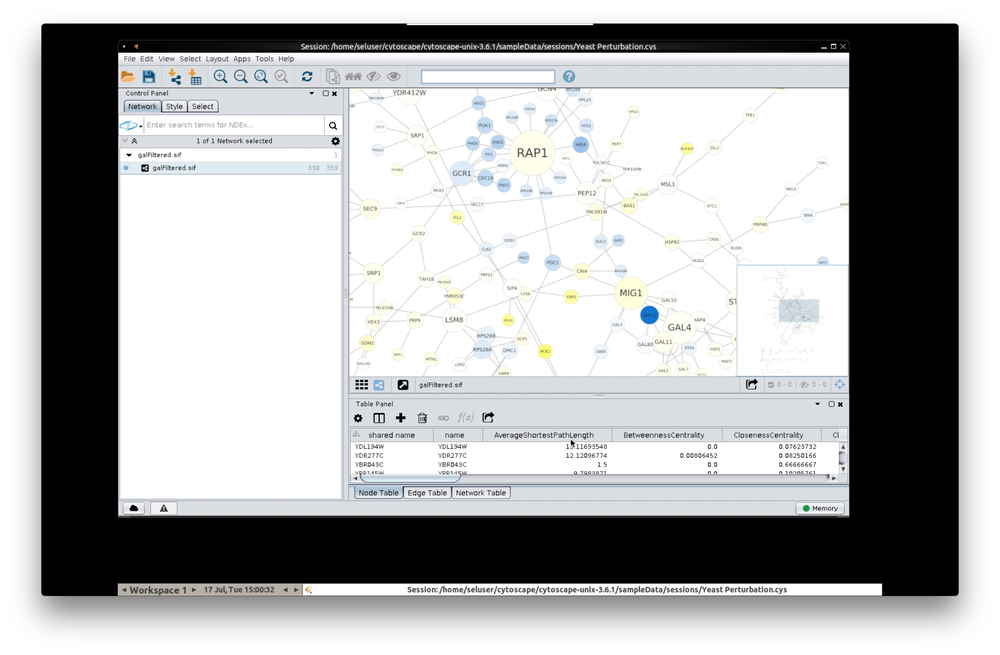

# Cytoscape Desktop in a Docker Image

Cytoscape Desktop in Docker image with GUI running using xvfb and VNC server



## Notes

This Docker image is built on top of the selenium/standalone-chrome-debug image.

https://hub.docker.com/r/selenium/standalone-chrome-debug/

# Build
```
docker build -t cytoscape/cytoscape-desktop .
```

# Run
## Launch Cytoscape in Docker
In a local terminal window, issue the following commands to run this docker container and launch Cytoscape:
```
docker rm -f cy; docker run --name cy \
  -v /Users/user/output:/home/seluser/cytoscape/output \ 
  -p 5900:5900 -p 1234:1234 -p 8080:8080 -p 6080:6080 \
  -e no_proxy=localhost \
  -e HUB_ENV_no_proxy=localhost \
  -e SCREEN_WIDTH=1270 -e SCREEN_HEIGHT=700 \
  -e VNC_NO_PASSWORD=1 \
  cytoscape/cytoscape-desktop \
  sh -c '/opt/bin/entry_point.sh & /home/seluser/noVNC/utils/launch.sh --vnc localhost:5900' &\
  (sleep 3; docker exec -it cy sh -c '/home/seluser/cytoscape/start.sh') &
```
_**Be sure to modify '/Users/user/output' to your own local working directory for Cytoscape output files**_

See below for a for a variety of ways to connect and interact with this instance of Cytoscape in Docker to monitor or 
troubleshoot. Otherwise, simply wait for Cytoscape to launch before issuing commands via CyREST. For example, wait
for this URL to return a valid response:
```
http://localhost:1234/v1/version
```
 
_**Note: Files saved in '/home/seluser/cytoscape/output' are accessible on the host system at '/Users/user/output'.**_ 
For example, in R using the RCy3 package you will want to prepend this output path to all your save and export args:
```
output.path <- '/home/seluser/cytoscape/output/'
saveSession(paste0(output.path, 'my-session-file'))
```

_Pro-tip: Before shutting down the container, be sure to check that all your output files have indeed been saved locally._

## Interact
### Local Shell
```
docker exec -it cy bash
```

### VNC
##### RealVNC
Connect with VNC (https://www.realvnc.com/download/viewer/) using the URL below:

* URL: localhost:5900
* Default password: secret

Additionally, the VNC viewer is available as a Chrome extension:

https://chrome.google.com/webstore/detail/vnc%C2%AE-viewer-for-google-ch/iabmpiboiopbgfabjmgeedhcmjenhbla?hl=en

and accessible via this link in Chrome:

chrome://apps/

##### noVNC
Built-in web-based VNC accessible at: http://localhost:6080/vnc.html?host=localhost&port=6080

##### TightVNC
Use TightVNC if having problems with right click on MacOS with noVNC and RealVNC: https://www.tightvnc.com/download.php

Running Java-Based TightVNC Client
```
java VncViewer HOST localhost PORT 5900
```

# Stop
```
docker stop cy
```
